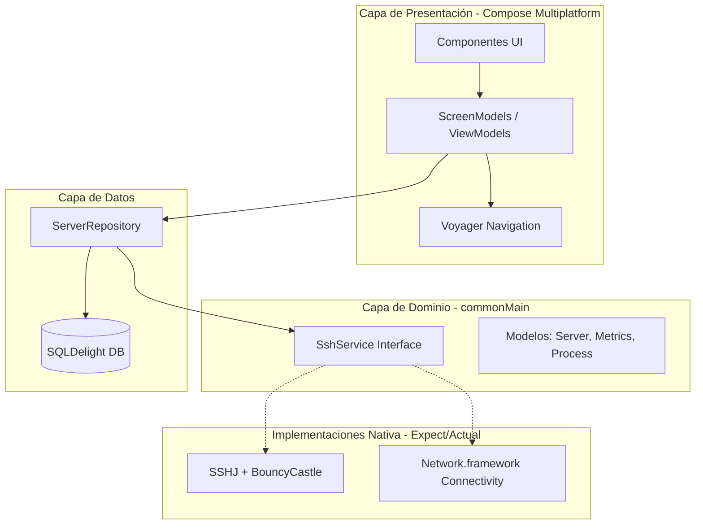

# sshApp - Remote Server Manager (KMP)

**sshApp** es una aplicación multiplataforma (Android, iOS, Desktop) desarrollada para el Trabajo de Fin de Grado (TFG). Su objetivo es permitir la gestión y monitorización remota de servidores mediante SSH, permitiendo visualizar métricas en tiempo real, gestionar procesos y acceder a una terminal integrada.

## 🏗️ Arquitectura del Sistema

El proyecto sigue los principios de **Clean Architecture** y está construido sobre **Kotlin Multiplatform (KMP)**. La lógica de negocio, la base de datos y la UI son compartidas en un ~90%.

