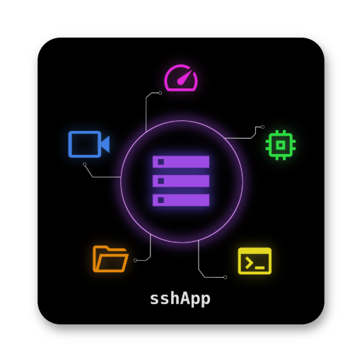

#  sshApp - Aplicación Multiplataforma para la Gestión de Servidores y Cámaras

## Descripción General

**sshApp** es una aplicación multiplataforma desarrollada en **Kotlin Multiplatform (KMP)** mediante la interfaz gráfica reactiva **Compose Multiplatform**. Su principal propósito es optimizar el trabajo de los administradores de sistemas, permitiendo agrupar el control de servidores Linux y cámaras de seguridad bajo una misma interfaz intuitiva.

La aplicación se caracteriza por funcionar bajo un modelo estricto de cliente-servidor sin requerir la instalación de agentes de terceros en las máquinas remotas. Toda la comunicación, monitorización y obtención de métricas se realiza interpretando comandos nativos a través de los protocolos cifrados SSH y SFTP.

---

## 📥 Descarga y Ejecución (Releases)

Para los usuarios que deseen utilizar la aplicación sin compilar el código fuente, desde la sección de **Releases** de este repositorio se puede descargar la aplicación ya compilada y lista para su uso en las diferentes plataformas compatibles:

* **Android**: Archivo `.apk` instalable.
* **Windows**: Ejecutable `.exe` / `.msi`.
* **Linux**: Paquetes precompilados (ej. `.deb` o `AppImage`, dependiendo de la release).

---

## ✨ Características Principales

* **Gestión Centralizada**: Creación, edición y categorización de servidores Linux y Cámaras IP en un panel adaptativo (Responsive).
* **Autenticación Segura**: Soporte para inicio de sesión mediante contraseña tradicional o mediante importación de archivos de clave privada RSA/Ed25519 (`.pem`, `.key`, `.pub`, `.ppk`).
* **Monitorización en Tiempo Real**: Análisis del uso de CPU, memoria RAM, espacio en disco, temperatura del procesador y sondeo de puertos activos mediante la ejecución asíncrona de comandos (`free`, `top`, `df`, `netstat`, etc.).
* **Terminal Interactiva**: Consola SSH completa integrada en la interfaz. Soporta atajos de teclado (Ctrl+C, Ctrl+R), autocompletado (Tab) y filtrado nativo de secuencias de escape ANSI para una correcta visualización del color y formato.
* **Explorador SFTP (File Manager)**: Interfaz de doble panel (Local/Remoto) para listar directorios y transferir archivos bidireccionalmente con indicador de progreso.
* **Transmisión de Vídeo RTSP**: Reproducción en directo con latencia ultrabaja del flujo de vídeo de cámaras de seguridad (soporte para códecs H.264/H.265).
* **Persistencia Local**: Almacenamiento seguro del historial de métricas y configuraciones usando **SQLite**.

---

## 🛠 Tecnologías y Stack Técnico

El proyecto está diseñado bajo los principios de **Clean Architecture** y el patrón **MVVM** adaptado para Compose.

* **Lenguaje Base**: Kotlin 2.x
* **Framework UI**: Compose Multiplatform (Material 3).
* **Navegación**: Voyager (Gestión de transiciones, pilas de pantallas y ciclo de vida mediante `ScreenModel`).
* **Inyección de Dependencias**: Koin (Configurado para inyectar repositorios, ViewModels y clientes SSH según la plataforma).
* **Base de Datos**: SQLDelight (Motor SQLite asíncrono y type-safe para el almacenamiento local de `DeviceEntity` y `MetricHistory`).
* **Red y SSH**:
    * Implementación basada en **SSHJ** para Android y JVM.
    * Inyección del proveedor criptográfico **Bouncy Castle** para soportar algoritmos modernos (ej. Ed25519) superando las limitaciones nativas de Android.
* **Sistema de Archivos**: Interfaz común abstracta apoyada en **Okio** para la manipulación de flujos de datos y **FileKit** para la selección de claves y archivos en el sistema nativo.
* **Multimedia (RTSP)**:
    * **Android**: ExoPlayer (Jetpack Media3).
    * **Escritorio (JVM)**: Wrapper de FFmpeg (JavaCV) ejecutado de forma concurrente con flags `nobuffer` y `low_delay`.

---

## 🏗 Arquitectura y Estructura del Proyecto

El repositorio se estructura aprovechando el sistema de *source sets* de Kotlin Multiplatform:

```text
sshApp/
├── composeApp/
│   ├── src/
│   │   ├── commonMain/      # Lógica compartida (90% del código): UI (Compose), Modelos, Repositorios, SQLDelight, Interfaces SSH.
│   │   ├── androidMain/     # Implementación específica Android: ExoPlayer, AndroidSshClient, Platform.
│   │   ├── jvmMain/         # Implementación específica Escritorio: FFmpeg, JvmSshClient, Platform.
│   │   ├── sharedJvmMain/   # Lógica compartida entre Android y Escritorio (Ej: AbstractSshjClient usando SSHJ).
│   │   └── iosMain/         # Implementación específica iOS (Network framework, decodificadores RTSP nativos).
```
### Lógica de Dispositivos (Servidor vs. Cámara)
El motor de análisis discrimina internamente si un equipo es un Servidor Linux estándar o una Cámara (arquitecturas embebidas basadas en BusyBox, como las cámaras con firmware Yi-Hack). Esto altera el flujo de ejecución subyacente de comandos (por ejemplo, adaptando los argumentos del comando `top` o `ps` al formato soportado por BusyBox).

---

## 💻 Manual de Instalación (Entorno de Desarrollo)

Para desarrolladores que deseen compilar o contribuir al código fuente:

1. **Clonar el repositorio:**
```text
   > git clone https://github.com/CuakCode/sshApp.git
   ```

2. **Abrir el proyecto** en Android Studio (recomendado por su soporte nativo para Compose Multiplatform y KMP).
3. Permitir que Gradle sincronice las dependencias definidas en `libs.versions.toml`.
4. Seleccionar el **Run Configuration** objetivo:
    * `composeApp` (Android): Requiere un emulador o dispositivo físico conectado por ADB.
    * `desktop` (JVM): Compilará y lanzará una ventana nativa en el sistema operativo anfitrión (Windows/Linux/macOS).

---

## ⚙️ Configuración y Uso

### 1. Ajustes Globales
Accesibles desde el icono de engranaje en la pantalla principal:
* **Retención de métricas**: Días de almacenamiento del historial (por defecto: 7).
* **Timeout de conexión**: Límite de tiempo para la resolución del Ping en milisegundos.
* **Tema de la aplicación**: Claro / Oscuro
* **Idioma**: Español
* **Ruta DB**: Opción para personalizar el directorio local del archivo SQLite (`.db`).

### 2. Añadir Dispositivos
Desde el botón `+`, se debe configurar:
* **Tipo**: Servidor / Cámara.
* **Red y Credenciales**: IP/Host, Puerto, Usuario y Contraseña/Clave Privada *(Las claves asimétricas se procesan localmente sin exponer su contenido)*.

### 3. Editar y eliminar Dispositivos
Manteniendo pulsado sobre el dispositivo.
* **Editar**: Se abrirá el cuadro de diálogo con los datos del dispositivo en cuestión.
* **Eliminar**: Se eliminará el dispositivo de la base de datos en cascada junto con sus métricas y la información relacionada con el mismo.

### 4. Operación
* **Panel de Monitor**: Genera sondeos (polling) cada ciertos segundos ejecutando rutinas silenciosas por SSH. Los datos se insertan en la base de datos y fluyen (`StateFlow`) hacia la UI reactiva.
* **Terminal**: Intercepta la escritura a través de un keylogger (entrada en crudo) y la retransmite de forma inmediata al flujo `OutputStream` de la PTY asignada.
* **Gestor de Archivos**: Descarga un fichero a un directorio temporal si se selecciona para visualizarlo, borrándolo de forma automática tras cerrar su visor nativo.

---

## 🚀 Limitaciones Conocidas y Trabajos Futuros

El proyecto se encuentra en desarrollo continuo. Entre las mejoras planificadas (Roadmap) se incluyen:

- [ ] Soporte para otros protocolos de transmisión de vídeo (ej. WebRTC).
- [ ] Gráficas lineales evolutivas para analizar el consumo de CPU/RAM a lo largo del tiempo.
- [ ] Integración y testeo completo en ecosistemas iOS puros.
- [ ] Optimización de la carga inicial en la transmisión de video RTSP.
- [ ] Añadir soporte para múltiples idiomas (i18n).
- [ ] Firmar la aplicación con una firma válida y confiable.
- [ ] Gestión de notificaciones personalizables para Android e iOS.

---

## 📄 Autor y Licencia

**Autor**: Pau  
*Proyecto desarrollado como Trabajo de Fin de Grado (TFG) para el Ciclo Formativo de Desarrollo de Aplicaciones Multiplataforma.*